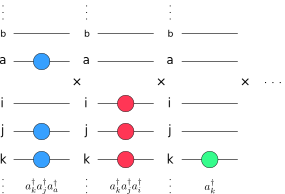
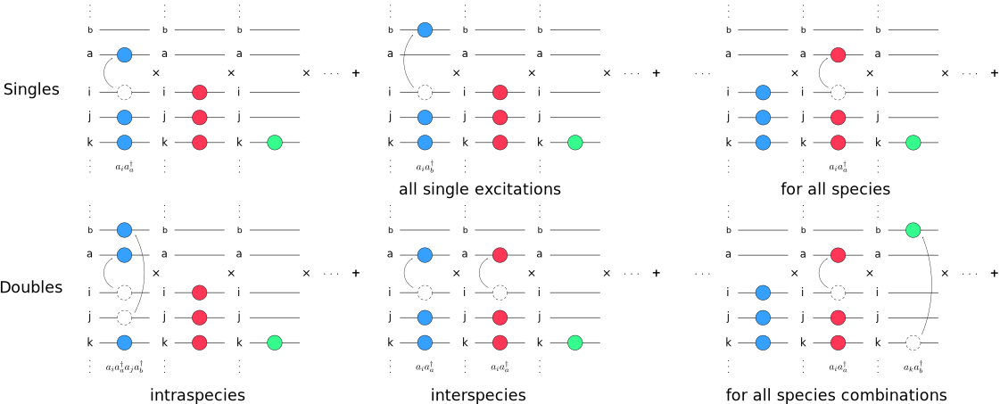
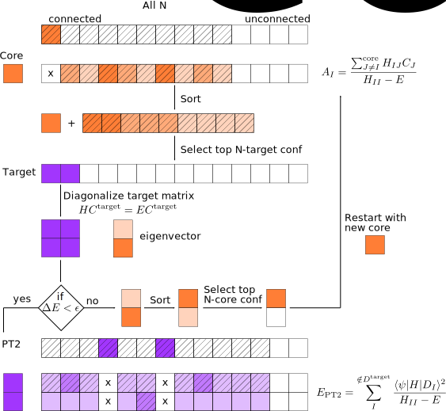

.. _CI:

=============================
Configuration Interaction, CI
=============================

CI Wavefunction 
===============

The APMO/CI wave function is written as a linear combination of CI configurations

.. math::
   :nowrap:

    \begin{equation}
      | \Psi_{\text{CI}} \rangle = \sum_{I}^{N_{\text{conf}}} c_I|\Psi_I\rangle
   \end{equation}

as products of Slater determinants between all quantum species

.. math::
  :nowrap:

     \begin{equation}
      | \Psi_I \rangle =
      \prod_{\alpha}^{N_{sp}} | D_I \rangle_{\alpha} = | D_I \rangle_{\alpha}  | D_I \rangle_{\beta}
      | D_I \rangle_{\gamma} \dots
   \end{equation}

where each is built as excitations within each type of quantum species, written in second quantization as:

.. math::
  :nowrap:

   \begin{equation}
    | D_I \rangle_{\alpha} = a_i^{\dagger}a_j^{\dagger}\dots a_{N_{\alpha}}^{\dagger} | \rangle_{\alpha}
    \end{equation}

For example,

   Schematic of multicomponent CI configuration

Normally in CI, those configurations are group together according to the excitation level

.. math::
  :nowrap:

   \begin{equation}
      | \Psi_{\text{CI}} \rangle = c_0|\Psi_0\rangle
      + \sum_{\alpha}\sum_{ia \in \alpha} c_i^a|\Psi_i^a \rangle
      +\sum_{\alpha,\beta}\sum_{\substack{ia\in\alpha\\jb\in\beta}} c_{ij}^{ab}|\Psi_{ij}^{ab} \rangle
      +\sum_{\alpha,\beta}\sum_{\substack{ia\in\alpha\\jb\in\alpha\\kc\in\beta}} c_{ijk}^{abc}|\Psi_{ijk}^{abc} \rangle
      + \cdots
   \end{equation}

leading to all singles excitations for all species, doubles within the same species (intraspecies), doubles as products of two single excitations from two different species (interspecies) for all possible pairs, as well as triples, quadrupoles, ... and so on.

   Schematic of multicomponent CI wave function 

Given that wavefunction, the CI Hamiltonian matrix are computed following Slater’s rules taking into accound that the multispecies potential operator are still a two-body operator at most.

Identical determinants:

.. math::
  :nowrap:
 
  \begin{equation}
  \langle \Phi_I | \hat{H} | \Phi_I \rangle =
  \sum_{\alpha}^{N_s} \sum_i^{N^{\alpha}} [i|\hat{h}|i] +
  \sum_{\alpha}^{N_s} \sum_i^{N^{\alpha}}\sum_{j>i}^{N^{\alpha}} ([ii|jj]-[ij|ji]) +
  \sum_{\alpha}^{N_s}\sum_{\beta > \alpha}^{N_s} \sum_{\substack{i \in \alpha \\ j \in \beta}}^{N^{\alpha}N^{\beta}} [ii|jj] 
  \end{equation}

One spin-orbital different

.. math::
  :nowrap:

  \begin{align}
  & | \Phi_I \rangle = | \cdots i_{\alpha} \cdots \rangle \prod_{\beta \ne \alpha}^{N_s} | \beta(I)\rangle \quad \quad
   | \Phi_J \rangle = | \cdots j_{\alpha} \cdots \rangle
  \prod_{\beta \ne \alpha}^{N_s} | \beta(I)\rangle \\
  & \langle \Phi_I | \hat{H} | \Phi_J \rangle = [i|\hat{h}|i] +  \sum_k^{N^{\alpha}} ([ij|kk]-[ik|kj]) +
  \sum_{\beta \ne \alpha}^{N_s} \sum_{k \in\beta}^{N^{\beta}}[ij|kk], \ \ i,j \in \alpha
  \end{align}

Two spin-orbital different, same species

.. math::
  :nowrap:

  \begin{align}
  & | \Phi_I \rangle = | \cdots i_{\alpha}j_{\alpha}  \cdots \rangle \prod_{\beta \ne \alpha}^{N_s} | \beta(I)\rangle \quad \quad | \Phi_J \rangle = | \cdots k_{\alpha}l_{\alpha}  \cdots \rangle
  \prod_{\beta \ne \alpha}^{N_s} | \beta(I)\rangle\\
  & \langle \Phi_I | \hat{H} | \Phi_J \rangle =
  [ik|jl]-[il|jk], \ \ i,j,k,l \in \alpha
  \end{align}

One spin-orbital different for two different quantum species

.. math::
  :nowrap:

  \begin{align}
  & | \Phi_I \rangle = | \cdots i_{\alpha} \cdots \rangle 
  | \cdots k_{\beta} \cdots \rangle 
  \prod_{\substack{\gamma \ne \alpha\\ \gamma\ne\beta}}^{N_s} | \gamma(I)\rangle \\ &
   | \Phi_J \rangle =  | \cdots j_{\alpha} \cdots \rangle 
  | \cdots l_{\beta} \cdots \rangle 
  \prod_{\substack{\gamma \ne \alpha\\ \gamma\ne\beta}}^{N_s} | \gamma(I)\rangle \\
  & \langle \Phi_I |  \hat{H} |  \Phi_J \rangle =  [ij| kl], \ \ i,j \in \alpha ,k,l \in \beta
  \end{align}

More than two spin orbital different within same species or more than two different species, differing in one spin orbital.

.. math::
  :nowrap:

  \begin{align}
  & \langle \Phi_I | \hat{H} | \Phi_J \rangle = 0
  \end{align}

The combinational CI coefficients :math:`c` are obtained variationally by solving the CI eigenvalue problem :math:`\textbf{Hc} = E\textbf{c}`. 
Due to the size of the Hamiltonian Matrix :math:`\textbf{H}`, it is necessary to use iterative techniques for diagonalization of real symmetric matrices avoiding the memory storage of the full matrix. Davidson's method is the most used technique to find the lowest eigenvalues and eigenvectors. Here, the storage requirements of :math:`\textbf{H}` can be greatly reduced by direct calculation of a matrix-vector product of the form :math:`\textbf{Hc} = \sigma`.

Selected CI, SCI
================

In openLOWDIN, the CI techniques aimed to select the most relevant configurations within the whole CI space are encompassed as the SCI family. These are usually categorized as stochastic or deterministic :cite:p:`eriksen_JPCL_11_8922_2020`. Currently the code has implemented an extended multicomponent version of Adaptive Sampling CI, ASCI :cite:p:`tubman_JCP_145_044112_2016`.

   Schematic of SCI algorithm

Natural orbitals
================

In CI, natural orbitals are special orbitals defined as the eigenfunctions of the one-particle reduced CI density. Using them significantly improves CI convergence by reducing the number of configurations needed to describe electron correlation. This allows a CI calculation to achieve good accuracy with a much smaller set of configurations, as natural orbitals focus on those with large occupation numbers. Thus, the CI reduced density matrix for the CI :math:`I`-th state is defined as 

.. math::
  :nowrap:
  
  \begin{equation}
  \gamma_{\mu,\nu}^{CI(I)} = \langle \Psi^{(I)} | a^{\dagger}_{\mu} a_{\nu} | \Psi^{(I)} \rangle 
  \end{equation} 

The natural orbitals are the eigenvectors of this density matrix, and the eigenvalues of the diagonalized density matrix are the natural occupation numbers, which indicate the importance of each natural orbital in the overall wave function.

Diagonal corrections
===================

CI Input options
================

* ``configurationInteractionLevel=`` *[character]*
  Select Configuration Interaction level. 

  .. list-table::
    :widths: 25 50
    :header-rows: 0
 
    * - ``"CIS"``
      - Singles
    * - ``"CISD"``
      - Singles and doubles
    * - ``"CISD-"`` 
      - Singles, doubles interspecies only 
    * - ``"CISD+"`` 
      - Singles, doubles, triples interpecies only 
    * - ``"CISDT"`` 
      - Singles, doubles, triples
    * - ``"CISDTQ"`` 
      - Singles, doubles, triples, quadruples 
    * - ``"SCI"`` 
      - Selected CI
    * - ``"FCI"`` 
      - Full CI
    * - ``"NONE"`` 
      - *Default*

* ``numberOfCIStates=`` *[integer]*
  Set the number of lowest energy eigenvectors to find for the CI matrix in increasing energy. *Default* ``1`` (Ground state)

* ``CIdiagonalizationMethod=`` *[character]*
  Select the diagonalization subroutine 

  .. list-table::
    :widths: 25 50
    :header-rows: 0
 
    * - ``"DSYEVX"``
      - LAPACK subroutine for selected eigenvalues and, optionally, eigenvectors of a real symmetric matrix. It requires to precompute and hold in memory the whole matrix (NXN) *Default*
    * - ``"DSYEVR"``
      - Newest LAPACK subroutine for selected eigenvalues and, optionally, eigenvectors of a real symmetric matrix. It requires to precompute and hold in memory the whole matrix (NXN) *Default*
    * - ``"JADAMILU"``
      - Jacobi-Davidson iterative algorithm. It requires to save only m-auxiliary matrix-vector products (NXm).

* ``CIdiagonalDressedShift=`` *[character]*
  Add a diagonal shift to the CI matrix for size-extensive corrections. Values: ``CISD``. *Default* ``"NONE"`` 

* ``CIstatesToPrint=`` *[integer]*
  Number of CI states to print additional information about configuration occupations.  *Default* ``1`` 

* ``CIsizeOfGuessMatrix=`` *[integer]*
  Size N of the initial CI space to initialize the first eigenvector guess, it requires to hold in memory a matrix of NXN size for its diagonalization  *Default* ``300`` 

* ``CIstackSize=`` *[integer]*
  Stacksize of an temporary array to load and save CI eigenvectors in disk. *Default* ``5000`` 

* ``CIConvergence=`` *[float]*
  Tolerance threshold for the eigenvector residual in JADAMILU *Default* ``1E-4`` 

* ``CImatvecTolerance=`` *[float]*
  Tolerance threshold in the CI eigenvector guess for skipping the matrix-vector calculation during JADAMILU's iterations. Higher values reduce the cost of each iteration but increase the number of steps.  *Default* ``1E-10`` 

* ``CISaveEigenVector=`` *[logical]*
  Save CI eigenvector for future computations *Default* ``.false.`` 

* ``CILoadEigenVector=`` *[logical]*
  Load previously saved CI eigenvector as an initial guess *Default* ``.false.`` 

* ``CIMadSpace=`` *[integer]*
  Desired size of the search space in JADAMILU, MS. The memory cost of JADAMILU's diagonalization is given by N*(3*MS+NEIG+1)+4*MS*MS. Where N is the number of configurations, and NEIG the number of desired eigenvectors to find. *Default* ``5`` 

* ``CINaturalOrbitals=`` *[logical]*
  Flag to compute natural orbitals after CI diagonalization. *Default* ``.false.`` 

* ``CIPrintEigenVectorsFormat=`` *[character]*
  Select the format to print the CI eigenvectors for each configuration above abs(CIPrintThreshold) 

  .. list-table::
    :widths: 25 50
    :header-rows: 0
 
    * - ``"ORBITALS"``
      - Print all orbitals occupation (0 or 1) 
    * - ``"OCCUPIED"``
      - Print the occupied orbitals index  *Default* 
    * - ``"NONE"``
      - No printing

* ``CIPrintThreshold=`` *[float]*
  Print all configurations above abs(CIPrintThreshold) for each eigenstate *Default* ``1E-1`` 

.. * ``CIactiveSpace=`` *[character]*  *Default* ``0!!Full`` 
.. * ``CImaxNCV=`` *[integer]*  *Default* ``30`` 
.. * ``CIJacobi=`` *[logical]*  *Default* ``.false.`` 
.. ** ``CIBuildFullMatrix=`` *[logical]* *Default* ``.false.`` 

