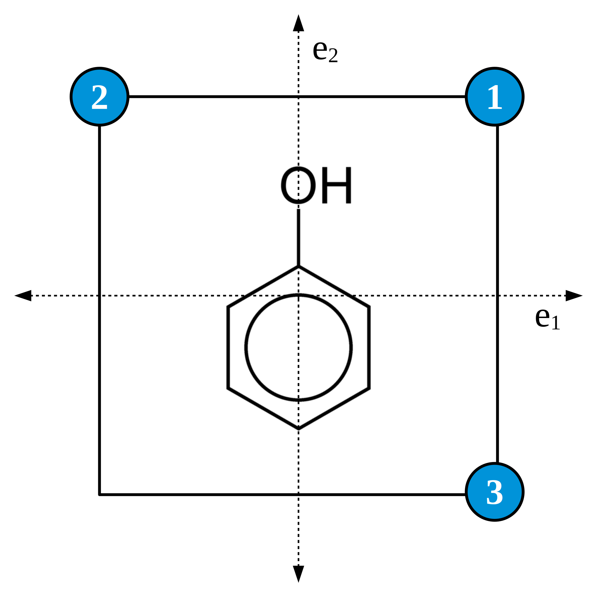

=======
Outputs
=======

Besides the standard output, openLowdin can generate other type of outputs to view the results of an APMO calculation. Lowdin input has an "OUTPUTS" block to request these outputs. Currently, it can generate:

* Molden files for each species.
* AIM files. These files are generated with the molden2AIM program 
* Gaussian cubes for orbitals and density
* Gnuplot 2D and 3D graphs for density and orbitals
* Gaussian fchk files

--------------------
Molden and AIM files
--------------------

To generate molden or AIM files simply add in the OUTPUTS block:

- moldenFile
- wfnFile
- wfxFile
- NBO47File

openLowdin will generate an .molden, .wfn, .wfx, or .47 file for each quantum species in the input.

For molden, there are three format types that can be selected with the CONTROL option 

.. list-table:: moldenFileFormat =
   :widths: 25 75
   :header-rows: 0
   * - QUANTUM
     - Define the coordinates, GTO and MO for each quantum species individually.
   * - STANDARD
     - Same that QUANTUM but including the coordinates of classical particles. (Default)
   * - MIXED
     - Same that STANDARD but including 1s GTO for each classical particles with zero contribution in the MO.

All three formats work with the MOLDEN software. Other visualization codes may require the MIXED or QUANTUM formats.

       If CI or NOCI calculations with "CIStatesToPrint" greater that zero were selected, the molden files will use the CI or NOCI natural orbitals. Also, adding "state=N" in the moldenFile line allow us to select the natural orbitals of the Nth excited state.
       
See :ref:`molden example` for full input examples to generate molden files
     
--------------
Gaussian Cubes 
--------------

openLowdin generates Gaussian density or orbital cubes of a chosen species. These cubes can be read by many visualization programs, such as VMD. To generate cubes, add in the OUTPUTS block the lines

* orbitalCube 
* densityCube 

openLowdin will generate a .cub file for each cube requested. 
  
Add in each line "species=symbol", where symbol is the quantum species to be plotted. To generate a cube for each species, use "species=ALL".
For orbital plots, select an orbital with "orbital=N". The default is the HOMO of each species. 

The position of the center of the cube is declared with "center=X Y Z" or with "point1=X Y Z".
With "cubeSize=N" we declare the length of one side of the cube.
The number of points is controled either by defining the number of points per side with "pointsPerDim=N", or the separation between points in one dimension, with "scanStep=N"

------------------------
Gnuplot 2D and 3D graphs
------------------------

openLowdin generates plots of the density or orbitals of a chosen species using Gnuplot. To do this, add in the OUTPUTS block the lines

* densityPlot 
* orbitalPlot 

As with the orbital cubes "species=symbol" selects the desired quantum species to be plotted. 
species=ALL is supported. For orbital plots, choose an orbital with "orbital=N", the default will be the HOMO of each species.

To create 2D plots, add dimensions=2, select and axis and provide TWO endpoints.

* axis="A" limitA=p1 p2, replace A with x, y, z

When using the axis directive, "offsetX=", "offsetY=", "offsetZ=" may be used to shift the plot.

A more general definition may be provided with

* point1=X1 Y1 Z1 point2=X2 Y2 Z2, where X,Y,Z are coordinates of each endpoint

For example, to plot the electronic density from -2.0 to 2.0 along the Z axis add one of the following lines

* densityPlot species="e-" dimensions=2 axis="z" limitZ=-2.0 2.0
* densityPlot species="e-" dimensions=2 point1= 0.0 0.0 -2.0 point2=0.0 0.0 2.0

To create 3D plots, set dimensions=3 and provide a plane with two endpoints for each axis

* plane="AB" limitA=p1 p2 limitB=p3 p4, replace A and B with x, y, z

 an offset along the unused axis may be selected to shift the plot.

A more general definition is also possible, where the user provides THREE points corresponding to the corners of a rectangle.

* point1=X1 Y1 Z1 point2=X2 Y2 Z2 point2=X3 Y3 Z3, where X,Y,Z are coordinates of each corner
  
For example, to plot electron density in the YZ plane, from -2.5 to 2.5 in both axis, use either of these lines

* densityPlot species="e-" dimensions=3 plane=yz limitY=-2.5 2.5 limitZ=-2.5 2.5
* densityPlot species="e-" dimensions=3 point1=0.0 2.5 2.5 point2=0.0 -2.5 2.5 point3=0.0 2.5 -2.5

In the general approach, the order of the corners is important. point1 must be the central coorner. See the following figure for an example

	   
In both 2D and 3D plots, the number of points is controled either by defining the number of points per side with "pointsPerDim=N", or the separation between points in one dimension, with "scanStep=N"

openLowdin will generate three files for Gnuplot: A .dens or a .orb with the raw data of the plot; a .gnp with the gnuplot script to generate the plot; and a .eps with the plot itself.

----------
Fchk files
----------

Gaussian fchk files may be used to pass the results to other programs. Currenty, openLowdin uses them to exchange information with Erkale for orbital localization. Add the line in the OUTPUTS

- fchkFile

to generate a file for each quantum species in the input. See :ref:`molden example` for an input example that employs orbital localization.

