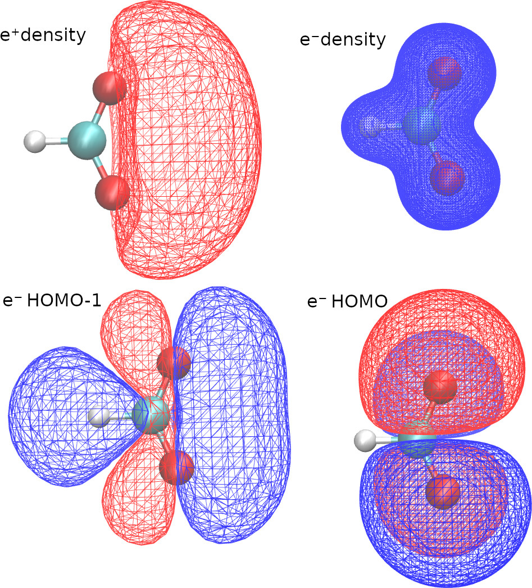
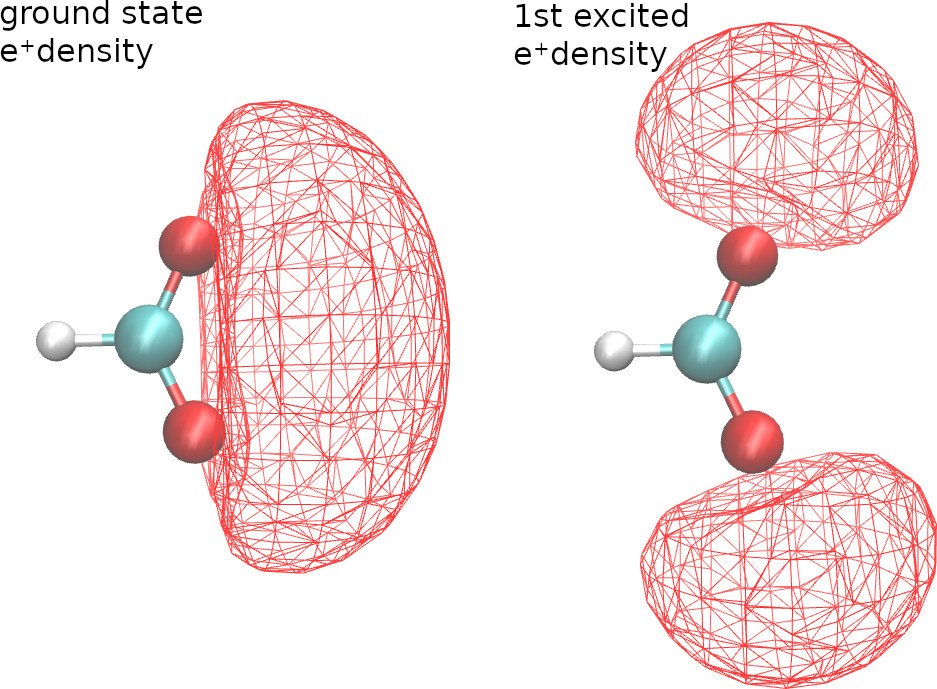

.. _cubes example:

==============
Cubes examples
==============

With openLowdin, we can generate orbital and density Gaussian cube files (https://h5cube-spec.readthedocs.io/en/latest/cubeformat.html ). Here we present an example for positronic formate

.. literalinclude:: inputs/HCOOPs.HF.densOrbCube.lowdin

With the first two lines in the OUTPUTS block, we request density cubes for electrons and positrons. Here, we use a different size for each cube, because the positronic density is more delocalized. 

With the last two lines of the OUTPUTS block, we request orbitals cubes. When we select "species"="ALL", openLowdin will generate a cube with the HOMO of each species.
We can also select a specific orbital, by selecting a species and an orbital number. In this example we requested the HOMO-1 of the formate anion.

We pass the option "center" or "point1" to define the origin of the cube, and we use the "pointsPerDim" or the "scanStep" options to adjust its resolution.
"scanStep" sets the separation between grid points, whereas "pointsPerDim=N" sets the total number of points per side, such that the number of points in the cube is N\ :sup:`3`.

Therefore, running this calculation produces five cube files, with the filenames provided in the output.

.. literalinclude:: out_highlights/HCOOPs.HF.densOrbCube.out

The VMD software (https://www.ks.uiuc.edu/Research/vmd/ ) is an excellent tool to visualize the cube files. Here are some VMD plots obtained from the positronic formate cubes

We can also request cubes for localized orbitals. The keywords required are identical to those employed in the :ref:`molden example`.

--------------
Excited states
--------------

For configuration interaction calculations, we can generate cubes for excited state natural orbitals and excited state densities. For example, with the following CI singles calculation,

.. literalinclude:: inputs/HCOOPs.CIS.densOrbCube.lowdin

we get the ground and first-excited state positronic densities.
		    

